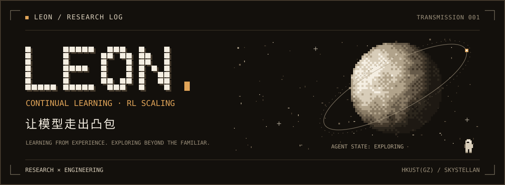
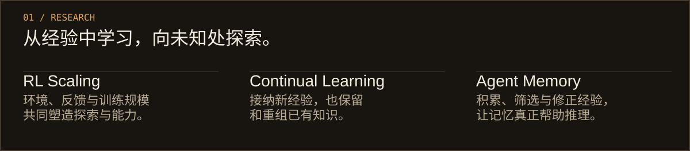
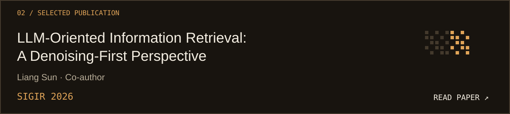
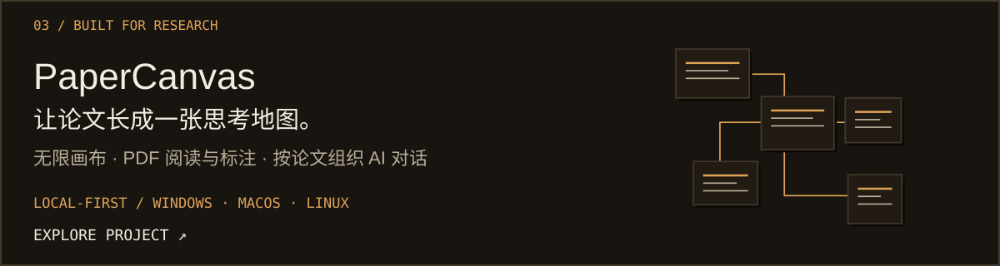
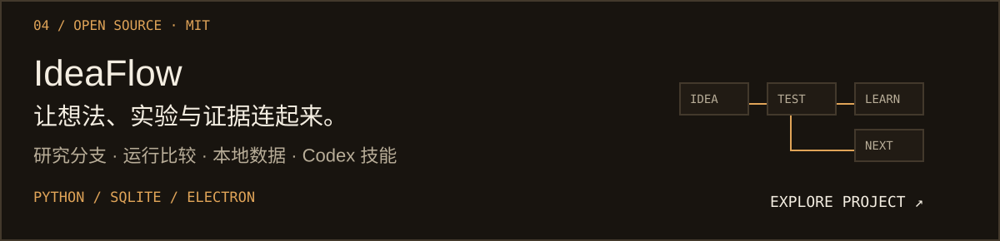

<strong>Leon / Liang Sun</strong> · 香港科技大学（广州）研究型硕士 研究模型，也给自己做工具。

<picture><source media="(max-width: 600px)" srcset="./assets/research-mobile.svg" /></picture>

<a href="https://doi.org/10.1145/3805712.3808544"><picture><source media="(max-width: 600px)" srcset="./assets/publication-mobile.svg" /></picture></a>

<a href="https://github.com/Skystellan/PaperCanvas"><picture><source media="(max-width: 600px)" srcset="./assets/papercanvas-mobile.svg" /></picture></a>

<a href="https://github.com/Skystellan/IdeaFlow"><picture><source media="(max-width: 600px)" srcset="./assets/ideaflow-mobile.svg" /></picture></a>

<a href="mailto:lsun913@connect.hkust-gz.edu.cn">写信交流</a> · <a href="https://orcid.org/0009-0003-3116-0787">ORCID</a> · <a href="https://github.com/Skystellan/PaperCanvas/releases/latest">下载 PaperCanvas</a> 欢迎科研合作与算法研发机会。

文字版介绍 / Text version

我是 Leon（Liang Sun），目前在香港科技大学（广州）攻读研究型硕士，本科毕业于哈尔滨工业大学。我关心模型如何从交互与经验中持续学习，以及这种学习能否扩展到新的任务和环境。

<ul>
  <li><strong>RL Scaling：</strong>环境、反馈与训练规模如何影响探索和能力提升？</li>
  <li><strong>Continual Learning：</strong>模型如何接纳新经验，同时保留和重组已有知识？</li>
  <li><strong>Agent Learning：</strong>探索智能体从交互中学习的能力，关注可靠性与泛化。</li>
</ul>

<strong>论文：</strong><a href="https://doi.org/10.1145/3805712.3808544">LLM-Oriented Information Retrieval: A Denoising-First Perspective</a> · SIGIR 2026 Lu Dai, <strong>Liang Sun</strong>, Fanpu Cao, Ziyang Rao, Cehao Yang, Hao Liu, Hui Xiong

<strong>项目：</strong><a href="https://github.com/Skystellan/PaperCanvas">PaperCanvas</a>，用于论文阅读、标注与思考整理的本地科研工作区。<a href="https://github.com/Skystellan/PaperCanvas/blob/main/README.zh-CN.md">使用指南</a>

<strong>项目：</strong><a href="https://github.com/Skystellan/IdeaFlow">IdeaFlow</a>，连接研究想法、实验与证据的本地科研画布，支持运行比较和 Codex 技能。已开源，采用 MIT 许可证；当前为单人本地 MVP。

<strong>联系：</strong><a href="mailto:lsun913@connect.hkust-gz.edu.cn">lsun913@connect.hkust-gz.edu.cn</a>

